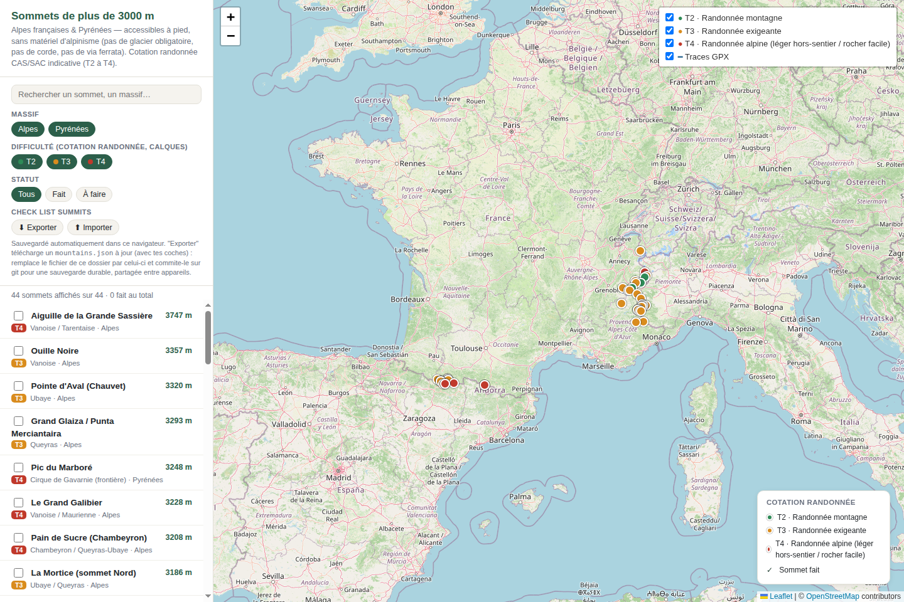

# project3000summitFR

Carte interactive (Leaflet + fonds OpenStreetMap) des sommets de plus de
3000 m des **Alpes françaises** et des **Pyrénées françaises** accessibles
à pied, sans matériel d'alpinisme (pas de glacier obligatoire, pas de
corde, pas de via ferrata).

## Aperçu



## Architecture

Le projet est composé de deux parties :

- **`static/`** — le frontend (carte Leaflet, `index.html`) et le
  **catalogue public** des sommets (`static/mountains.json` : nom,
  altitude, coordonnées, cotation, notes, source — versionné dans ce
  dépôt, partagé avec tout le monde).
- **`server/app.py`** — un petit backend Python (bibliothèque standard
  uniquement ; Pillow en option pour les miniatures, voir plus bas) qui sert le frontend et
  fusionne le catalogue public avec les **données personnelles**
  (sommets faits, commentaires, photos/vidéos, traces GPX), stockées dans
  `data/` — **jamais dans ce dépôt** (voir `.gitignore`). Toute écriture
  (case cochée, commentaire, upload) passe par ce serveur et va
  directement sur le disque de la machine qui héberge l'appli : pas de
  `localStorage`, pas d'IndexedDB, rien à exporter/importer.

Ce découpage permet à n'importe qui de cloner ce dépôt pour héberger sa
propre instance (avec le même catalogue de sommets, ou le sien), sans
jamais récupérer les données personnelles de quelqu'un d'autre — chaque
instance garde les siennes localement, hors git.

## Utiliser en local (développement / test rapide)

Sans Docker, avec juste Python 3 :

```bash
python3 server/app.py
```

puis ouvrir <http://localhost:8000>. Les données personnelles sont
stockées dans `data/` (créé automatiquement à côté du dépôt).

## Auto-hébergement sur son propre serveur

Le projet fournit un `Dockerfile` + `docker-compose.yml` (appli + Caddy
en reverse proxy avec Basic Auth) prêts à l'emploi. Prérequis : Docker et
Docker Compose installés sur le serveur.

```bash
git clone https://github.com/celtill0s/project3000summitFR.git
cd project3000summitFR
```

1. **Créer les identifiants Basic Auth** (protège tout le site — sans ça,
   n'importe qui atteignant le port pourrait cocher/commenter/uploader).
   Deux comptes sont prévus :

   - **ton compte** (lecture + écriture), identifiant au choix ;
   - **`operator`**, en **lecture seule** : Caddy refuse toute requête
     `POST`/`DELETE` faite sous cette identité (voir `Caddyfile`). Pratique
     pour montrer la carte à quelqu'un sans lui donner la main sur tes
     données.

   ```bash
   mkdir -p secrets
   # hash de ton mot de passe
   docker run --rm caddy:2-alpine caddy hash-password --plaintext 'TON_MOT_DE_PASSE'
   echo -n 'TON_IDENTIFIANT' > secrets/basic_auth_user
   echo -n 'LE_HASH_AFFICHÉ_CI-DESSUS' > secrets/basic_auth_hash
   # hash du mot de passe du compte "operator" (lecture seule)
   docker run --rm caddy:2-alpine caddy hash-password --plaintext 'MOT_DE_PASSE_OPERATOR'
   echo -n 'LE_HASH_AFFICHÉ_CI-DESSUS' > secrets/operator_hash
   chmod 600 secrets/*
   ```

   Les trois fichiers sont obligatoires (`docker compose up` échoue si
   l'un d'eux manque). Ils ne sont jamais commités et ne transitent
   jamais par une variable d'environnement `.env` : Docker les monte
   comme *secrets*, invisibles via `docker inspect`.

2. **Lancer** :

   ```bash
   mkdir -p data   # à créer AVANT le premier lancement, voir ci-dessous
   docker compose up -d --build
   ```

   `data/` doit exister et appartenir à l'uid 1000 (l'utilisateur non-root
   du conteneur) : si Docker le crée lui-même au lancement, il appartient
   à root et l'appli plante (`PermissionError: '/data'`). Correction :
   `sudo chown -R 1000:1000 data`.

   Le site écoute alors sur `127.0.0.1:8087` (modifiable dans
   `docker-compose.yml`), protégé par la Basic Auth.

3. **L'exposer** derrière ton propre reverse proxy / tunnel — le projet
   ne présuppose rien de particulier ici : un Caddy/nginx existant, un
   Cloudflare Tunnel, un Tailscale Funnel, etc. suffit à pointer un nom
   de domaine vers `http://<ton-serveur>:8087`.

4. **Mettre à jour** plus tard :

   ```bash
   ./update.sh
   ```

   (`git pull --ff-only` puis `docker compose up -d --build`, sans arrêt
   préalable : si le pull échoue, l'appli continue de tourner avec la
   version actuelle. Ne touche jamais à `data/` ni `secrets/`, qui restent
   hors git).

   Au démarrage, le serveur convertit automatiquement un ancien
   `data/progress.json` (indexé par nom de sommet) au format indexé par
   `id`. Une entrée qui ne correspond à aucun sommet (renommé avant
   l'arrivée des ids) est conservée et signalée dans les logs
   (`docker compose logs app`) : il suffit alors de renommer sa clé dans
   `progress.json` avec l'`id` du sommet.

### Sauvegarde

Tout ce qui compte pour ton instance (progression, commentaires,
photos/vidéos, traces GPX) vit dans `data/` — un simple dossier à
sauvegarder comme n'importe quel autre (copie, rsync, snapshot…).

Le script `scripts/backup.sh` crée des snapshots datés de `data/` avec
`rsync --link-dest` (les fichiers inchangés sont des liens durs : chaque
snapshot est complet sans dupliquer l'espace disque), et purge ceux de
plus de 30 jours. Variables : `BACKUP_ROOT` (défaut
`~/backups-project3000summitFR`), `RETENTION_DAYS`, `DATA_DIR`.
Exemple de crontab (tous les jours à 3 h) :

```cron
0 3 * * * /chemin/vers/project3000summitFR/scripts/backup.sh >> ~/backup-summit.log 2>&1
```

⚠️ Les snapshots restent sur le même disque que l'appli : ils protègent
d'une suppression accidentelle, pas d'une panne matérielle. Copie
`BACKUP_ROOT` ailleurs pour ça.

## Contenu

- **`static/index.html`** — la carte : panneau latéral (recherche,
  filtres par massif/difficulté/statut, liste triée par altitude, faits
  en premier), carte Leaflet avec un **calque par niveau de difficulté**
  (T2/T3/T4), panneau flottant déplaçable par sommet (cotation détaillée,
  case "fait", commentaire, photos/vidéos, trace GPX).
- **`static/js/`** — le code du frontend, en modules ES natifs (pas de
  bundler, pas de `npm install` pour faire tourner l'appli) : `main.js`
  (point d'entrée), `map.js`, `panel.js`, `sidebar.js`, `gpx.js`,
  `photos.js`, `lightbox.js`… ; `eslint.config.mjs` sert uniquement à la CI.
- **`static/mountains.json`** — le catalogue public : nom, altitude,
  coordonnées, massif, région, cotation de difficulté (échelle CAS/SAC),
  notes d'accès, source.
- **`server/app.py`** — le backend (voir "Architecture" ci-dessus).
- **`static/vendor/`** — Leaflet 1.9.4 et Leaflet.markercluster 1.5.3,
  copiés tels quels (avec leur licence) : aucun script chargé depuis un
  CDN tiers.
- **`data/`** (généré à l'exécution, jamais commité) — `progress.json`
  (sommets faits/commentaires/références photos-vidéos-gpx, indexés par
  `id` de sommet), `photos/<id>/`, `gpx/<id>.gpx`, `thumbs/` (miniatures,
  régénérables : inutile de les sauvegarder).
- **`sources.md`** — méthodologie complète : comment chaque sommet a été
  sélectionné, comment sa cotation a été déterminée, sources utilisées et
  limites connues (inclut l'audit critique du 2026-09-01).

## Fonctionnalités

- **Calques par difficulté** : chaque niveau de cotation (T2, T3, T4) est
  un calque Leaflet indépendant, à afficher/masquer via le contrôle en
  haut à droite de la carte ou les puces de la barre latérale (les deux
  restent synchronisés).
- **Fonds de carte** : par défaut **« Auto »** — OpenStreetMap quand la
  carte est dézoomée, Plan IGN dès que l'échelle affiche 20 km — zoom 9 (constante
  `IGN_FROM_ZOOM` dans `static/js/map.js`) ; ou au choix Plan IGN, photos
  aériennes IGN, OpenStreetMap. Plus une surcouche IGN des **pentes > 30°** (zones
  potentiellement avalancheuses). Flux publics de la Géoplateforme IGN,
  sans clé. Les tuiles IGN sont vides hors de France : pour le versant
  espagnol ou italien d'un sommet frontalier, basculer sur OpenStreetMap.
  Le fond choisi est mémorisé par le navigateur. (Le SCAN 25, la carte
  topo « randonnée » IGN, n'est pas disponible sans clé personnelle.)
- **Échelle** métrique en bas à gauche de la carte.
- **Filtres** : par massif (Alpes/Pyrénées), par difficulté, par statut
  (fait / à faire), et recherche texte libre (nom, massif).
- **Suivi "sommet fait"**, **commentaire personnel**, **photos et
  vidéos** (avec visionneuse plein écran et défilement entre médias) et
  **trace GPX par sommet** (import, profil altimétrique, dénivelé,
  export) : tout est enregistré immédiatement côté serveur, visible
  depuis n'importe quel appareil qui se connecte à la même instance.
- **Vidéos** servies avec support des requêtes `Range` (avance rapide,
  lecture sur iPhone/Safari) ; les uploads sont écrits sur disque au fil
  de l'eau, jamais chargés entièrement en mémoire (confortable sur un
  Raspberry Pi, même pour une vidéo de 500 Mo).
- **Miniatures et HEIC** : si [Pillow](https://python-pillow.org/) (et
  `pillow-heif`) est installé — c'est le cas dans l'image Docker —, la
  grille affiche des miniatures JPEG générées à la demande, et les photos
  HEIC d'iPhone sont converties en JPEG pour être visibles dans tous les
  navigateurs. Sans Pillow, les originaux sont servis tels quels.
  En local : `pip install -r requirements.txt`.
- **Vue crampons/piolet** : sommets faisables hors saison avec crampons
  et piolet (champ `crampon` du catalogue).

## Modifier le catalogue

Éditer `static/mountains.json` directement (tableau JSON, un objet par
sommet). Chaque entrée suit ce schéma :

```json
{
  "id": "nom-du-sommet",
  "name": "Nom du sommet",
  "altitude_m": 3025,
  "lat": 44.6783,
  "lon": 6.9636,
  "massif": "Nom du massif",
  "region": "Alpes" ou "Pyrénées",
  "difficulty": "T2" | "T3" | "T4",
  "notes": "Description courte de l'itinéraire/accès",
  "source": "domaine-source.fr",
  "source_url": "https://... (page précise, affichée en lien cliquable dans le \"Détail de la cotation\")",
  "crampon": {
    "grade": "F",
    "confirmed": true,
    "season": "Juin – juillet",
    "note": "Optionnel : extension crampons+piolet hors saison (vue dédiée)"
  }
}
```

⚠️ **L'`id` ne doit jamais changer** une fois le sommet publié : c'est la
clé des données personnelles (`data/progress.json`, dossiers photos et
GPX). Pour corriger un nom, modifier `name` seulement. Pour un nouveau
sommet, prendre le nom en minuscules, sans accents, mots séparés par des
tirets.

`pytest` valide automatiquement le catalogue (champs, cotations,
coordonnées, unicité des ids) — lancé aussi par la CI à chaque push.

(Les champs `done`, `comment`, `photos`, `gpx` ne font **pas** partie du
catalogue : ce sont des données personnelles, gérées par le serveur dans
`data/progress.json`.)

Voir `sources.md` pour le barème de cotation et les sources de référence à
utiliser pour toute nouvelle entrée.
