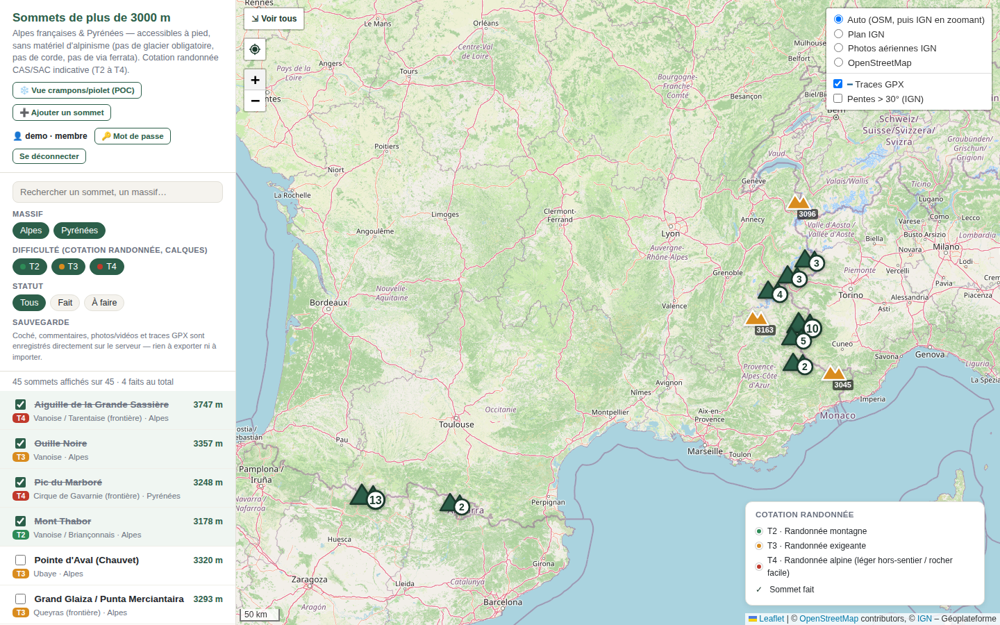
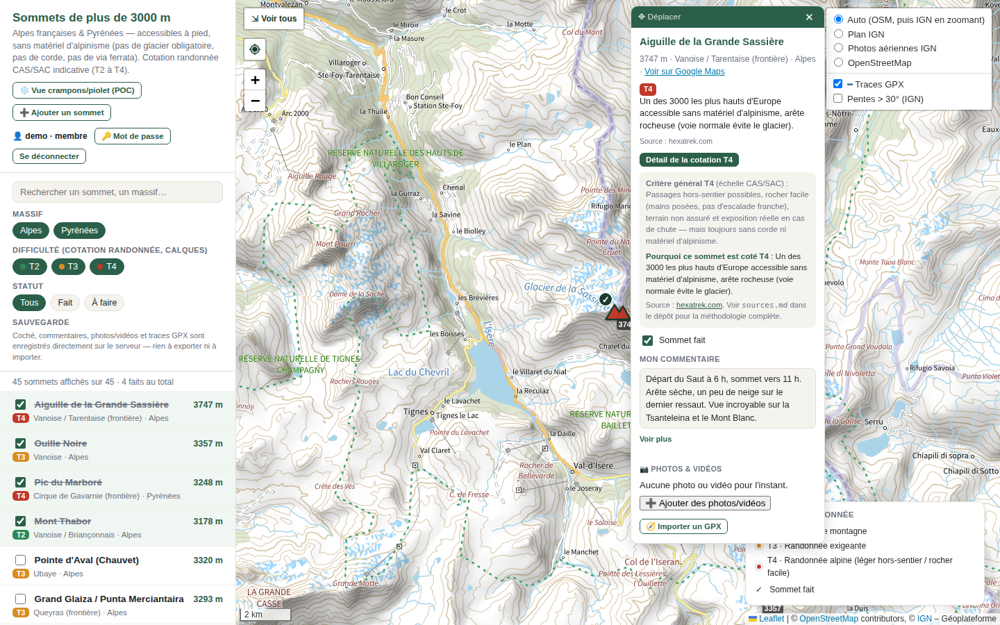
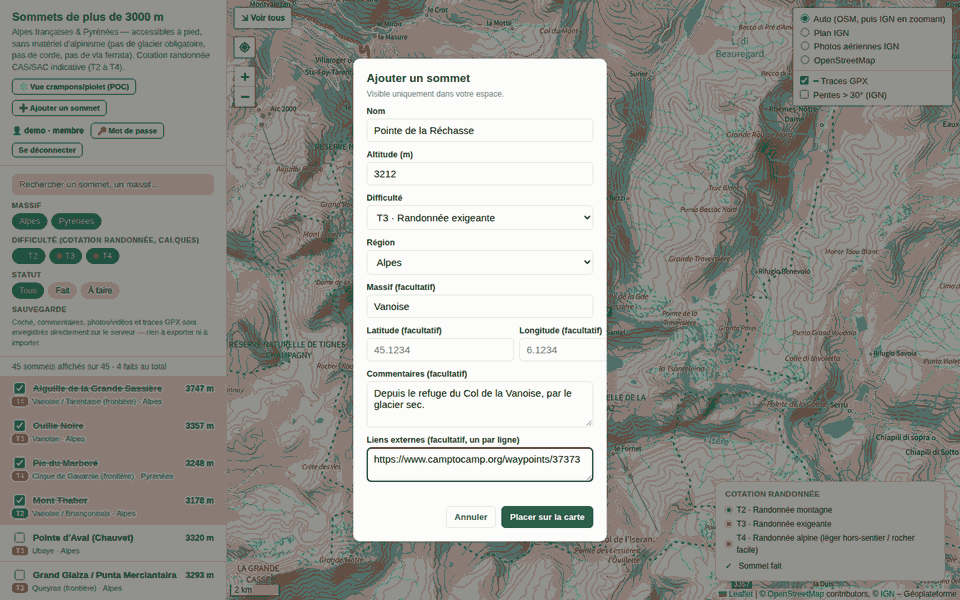
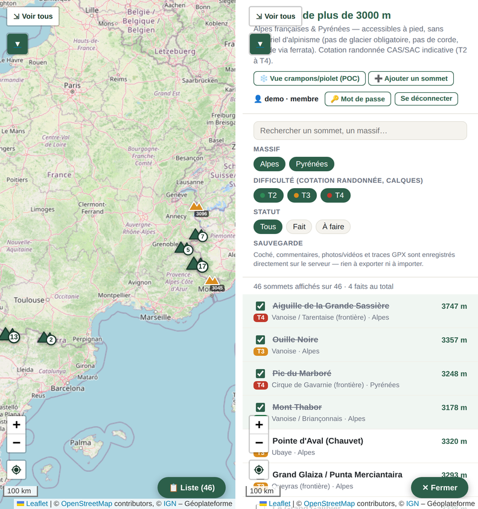
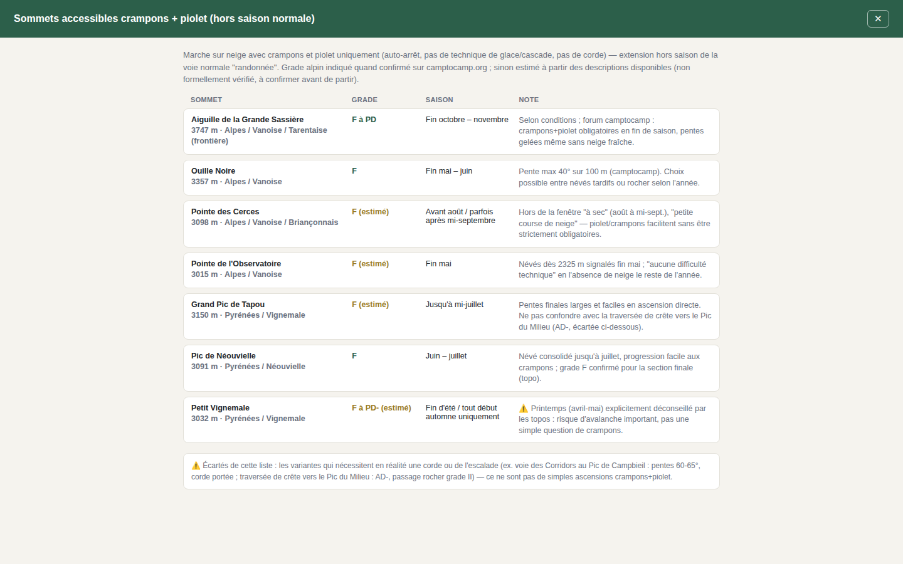
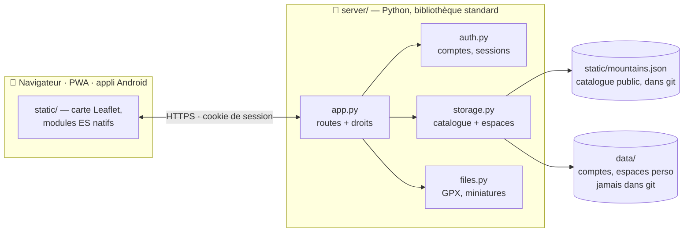

<div align="center">


# Sommets de plus de 3000 m

**Tous les sommets de plus de 3000 m des Alpes et des Pyrénées françaises accessibles à pied —
sans glacier obligatoire, sans corde, sans via ferrata — sur une carte, avec ton carnet de
courses personnel.**

[](https://github.com/celtill0s/project3000summitFR/actions/workflows/ci.yml)
[](https://github.com/celtill0s/project3000summitFR/releases)


[Aperçu](#-aperçu) · [Démarrage rapide](#-démarrage-rapide) · [Auto-hébergement](#-auto-hébergement-sur-son-propre-serveur) · [Fonctionnalités](#-fonctionnalités) · [Catalogue](#-modifier-le-catalogue) · [Appli Android](android/README.md)



</div>

## 📸 Aperçu

<table>
  <tr>
    <td width="50%" valign="top">
      
      <p align="center"><b>Fiche de chaque sommet</b><br>cotation CAS/SAC détaillée, source, sommet fait, commentaire, photos/vidéos, trace GPX — sur fond Plan IGN</p>
    </td>
    <td width="50%" valign="top">
      
      <p align="center"><b>Tes propres sommets</b><br>formulaire, puis placement en faisant glisser le marqueur, et validation — visibles de toi seul</p>
    </td>
  </tr>
  <tr>
    <td width="50%" valign="top">
      
      <p align="center"><b>Sur téléphone</b><br>carte plein écran, liste à la demande ; installable (PWA) ou en <a href="android/README.md">appli Android</a>, utilisable hors-ligne</p>
    </td>
    <td width="50%" valign="top">
      
      <p align="center"><b>Vue crampons/piolet</b><br>les sommets faisables hors saison avec crampons et piolet, grade alpin confirmé sur camptocamp</p>
    </td>
  </tr>
</table>

## 🚀 Démarrage rapide

Juste Python 3, sans Docker ni dépendance :

```bash
git clone https://github.com/celtill0s/project3000summitFR.git && cd project3000summitFR
python3 server/app.py create-admin moi   # une fois : crée ton compte
python3 server/app.py                    # puis ouvre http://localhost:8000
```

Les données sont stockées dans `data/` (créé automatiquement, jamais commité). Pour un vrai
serveur, voir [Auto-hébergement](#-auto-hébergement-sur-son-propre-serveur).

## 🧭 Architecture


```mermaid
flowchart LR
    subgraph Navigateur["📱 Navigateur · PWA · appli Android"]
        UI["static/ — carte Leaflet,<br>modules ES natifs"]
    end
    subgraph Serveur["🐍 server/ — Python, bibliothèque standard"]
        APP["app.py<br>routes + droits"] --> AUTH["auth.py<br>comptes, sessions"]
        APP --> STORE["storage.py<br>catalogue + espaces"]
        APP --> FILES["files.py<br>GPX, miniatures"]
    end
    CAT[("static/mountains.json<br>catalogue public, dans git")]
    DATA[("data/<br>comptes, espaces perso<br>jamais dans git")]
    UI <-->|HTTPS · cookie de session| APP
    STORE --> CAT
    STORE --> DATA
```

- **`static/`** — le frontend (carte Leaflet, `index.html`, page de connexion `login.html`) et le
  **catalogue public** des sommets (`static/mountains.json` : nom, altitude, coordonnées,
  cotation, notes, source — versionné dans ce dépôt, partagé avec tout le monde).
- **`server/`** — un petit backend Python (bibliothèque standard uniquement ; Pillow en option
  pour les miniatures) qui sert le site et fusionne le catalogue avec l'**espace personnel** de
  l'utilisateur connecté (sommets faits, commentaires, photos/vidéos, traces GPX, sommets
  ajoutés). Tout est stocké dans `data/` — **jamais dans ce dépôt** (voir `.gitignore`).

N'importe qui peut donc cloner ce dépôt pour héberger sa propre instance (avec le même
catalogue, ou le sien), sans jamais récupérer les données personnelles de quelqu'un d'autre.

## 👥 Comptes et rôles

Tout le site est derrière une **page de connexion** (aucun accès sans
compte). Trois rôles :

| Rôle | Voit | Peut modifier |
|---|---|---|
| **Invité** | le catalogue seul (carte, sommets, cotations, vue crampons) — rien de ce qu'un utilisateur a ajouté | rien |
| **Membre** | **son propre espace** : ses sommets faits, commentaires, photos, traces GPX | son espace |
| **Administrateur** | son espace, et l'espace de n'importe quel membre (lecture seule, bouton « Voir son espace ») | son espace + les comptes |

- L'administrateur gère les comptes depuis l'onglet **👥 Utilisateurs** :
  création (avec mot de passe provisoire généré), changement de rôle,
  nouveau mot de passe, suppression (avec toutes les données du compte).
  Il reste toujours au moins un administrateur.
- Chacun peut changer son propre mot de passe (**🔑 Mot de passe**) ; ses
  autres appareils sont alors déconnectés.
- Sécurité : mots de passe hachés (scrypt), session dans un cookie
  `HttpOnly`/`Secure`/`SameSite`, protection contre les requêtes forgées
  (CSRF), **blocage temporaire après 5 échecs de connexion** (par
  identifiant et par adresse IP). Les droits sont vérifiés par le serveur
  sur chaque requête (table `ROUTES` de `server/app.py` : toute route non
  déclarée est refusée), et un test couvre chaque route pour chaque rôle
  (`tests/test_server_app.py`, « matrice des droits »).
- Données : `data/users.json` (comptes), `data/sessions.json` (sessions,
  seule l'empreinte du jeton est gardée), `data/users/<identifiant>/`
  (espace de chaque utilisateur).
- **5 Go maximum par utilisateur** (photos, vidéos, GPX ; miniatures non
  comptées) : au-delà, les envois sont refusés et un bandeau rouge reste
  affiché sur son espace tant qu'il n'a pas libéré de place. L'admin voit
  l'espace occupé par chacun dans « Utilisateurs ». Limite modifiable :
  `QUOTA_BYTES` dans `server/storage.py`.
- Chaque membre peut **ajouter ses propres sommets** (➕ Ajouter un sommet),
  les placer sur la carte, puis les modifier ou les supprimer : ils ne sont
  visibles que dans son espace (`custom_peaks.json`).

Commandes d'administration (sur le serveur) :

```bash
docker compose exec app python3 server/app.py create-admin <identifiant>   # premier admin
docker compose exec app python3 server/app.py set-password <identifiant>   # secours (mot de passe oublié)
docker compose exec app python3 server/app.py list-users
```

(sans Docker : `python3 server/app.py …`). Le mot de passe est demandé au
clavier.

## 🐳 Auto-hébergement sur son propre serveur

Le projet fournit un `Dockerfile` + `docker-compose.yml` (appli + Caddy
en reverse proxy) prêts à l'emploi. Prérequis : Docker et Docker Compose
installés sur le serveur.

```bash
git clone https://github.com/celtill0s/project3000summitFR.git
cd project3000summitFR
```

1. **Lancer** :

   ```bash
   mkdir -p data   # à créer AVANT le premier lancement, voir ci-dessous
   docker compose up -d --build
   ```

   `data/` doit exister et appartenir à l'uid 1000 (l'utilisateur non-root
   du conteneur) : si Docker le crée lui-même au lancement, il appartient
   à root et l'appli plante (`PermissionError: '/data'`). Correction :
   `sudo chown -R 1000:1000 data`.

2. **Créer ton compte administrateur** :

   ```bash
   docker compose exec app python3 server/app.py create-admin <identifiant>
   ```

   Tant qu'aucun compte n'existe, personne ne peut se connecter (les logs
   le rappellent : `docker compose logs app`).

   Le site écoute sur `127.0.0.1:8087` (modifiable dans
   `docker-compose.yml`). Caddy ne vérifie pas de mot de passe (c'est
   l'appli qui gère les comptes) mais protège le serveur Python : délais
   d'expiration contre les connexions volontairement lentes, taille
   maximale des requêtes. Le conteneur de l'appli est verrouillé
   (système de fichiers en lecture seule sauf `data/`, aucun privilège).

3. **L'exposer** derrière ton propre reverse proxy / tunnel — le projet
   ne présuppose rien de particulier ici : un Caddy/nginx existant, un
   Cloudflare Tunnel, un Tailscale Funnel, etc. suffit à pointer un nom
   de domaine vers `http://<ton-serveur>:8087`. **HTTPS obligatoire** côté
   public (le cookie de session n'est envoyé qu'en HTTPS).

4. **Mettre à jour** plus tard :

   ```bash
   ./update.sh
   ```

   (`git pull --ff-only` puis `docker compose up -d --build`, sans arrêt
   préalable : si le pull échoue, l'appli continue de tourner avec la
   version actuelle. Ne touche jamais à `data/`, qui reste hors git).

### Mise à jour d'une instance d'avant les comptes

<details>
<summary>Instances installées avant l'arrivée des comptes (Basic Auth de Caddy, dossier <code>secrets/</code>)</summary>

Les versions précédentes protégeaient le site par la Basic Auth de Caddy
(fichiers `secrets/`), avec un seul espace de données. Après `./update.sh` :

1. **Créer ton compte administrateur** — tes données existantes
   (`data/progress.json`, `photos/`, `gpx/`) lui sont **automatiquement
   rattachées** (déplacées dans `data/users/<identifiant>/`, rien n'est
   supprimé ni écrasé) :

   ```bash
   docker compose exec app python3 server/app.py create-admin <identifiant>
   ```

   Entre `./update.sh` et cette commande, personne ne peut se connecter :
   enchaîne les deux.

2. Ouvre le site, connecte-toi, et crée les autres comptes depuis
   **👥 Utilisateurs** (l'ancien compte `operator` en lecture seule
   n'existe plus : crée à la place un compte **Invité** ou **Membre**).

3. Le dossier `secrets/` ne sert plus : tu peux le supprimer.

4. Appli Android : installe la version qui gère les comptes (l'ancienne
   utilisait la Basic Auth et ne peut plus se connecter).

Conseil : fais une sauvegarde de `data/` avant (`scripts/backup.sh`).

</details>

### Sauvegarde

Tout ce qui compte pour ton instance (progression, commentaires,
photos/vidéos, traces GPX) vit dans `data/` — un simple dossier à
sauvegarder comme n'importe quel autre (copie, rsync, snapshot…).

Le script `scripts/backup.sh` crée des snapshots datés de `data/` avec
`rsync --link-dest` (les fichiers inchangés sont des liens durs : chaque
snapshot est complet sans dupliquer l'espace disque), et purge ceux de
plus de 30 jours. Variables : `BACKUP_ROOT` (défaut
`~/backups-project3000summitFR`), `RETENTION_DAYS`, `DATA_DIR`.
Exemple de crontab (tous les jours à 3 h) :

```cron
0 3 * * * /chemin/vers/project3000summitFR/scripts/backup.sh >> ~/backup-summit.log 2>&1
```

⚠️ Les snapshots restent sur le même disque que l'appli : ils protègent
d'une suppression accidentelle, pas d'une panne matérielle. Copie
`BACKUP_ROOT` ailleurs pour ça.

## 📁 Organisation du dépôt

<details>
<summary>Ce que contient chaque dossier</summary>

- **`static/index.html`** — la carte : panneau latéral (recherche,
  filtres par massif/difficulté/statut, liste triée par altitude, faits
  en premier), carte Leaflet avec un **calque par niveau de difficulté**
  (T2/T3/T4), panneau flottant déplaçable par sommet (cotation détaillée,
  case "fait", commentaire, photos/vidéos, trace GPX).
- **`static/js/`** — le code du frontend, en modules ES natifs (pas de
  bundler, pas de `npm install` pour faire tourner l'appli) : `main.js`
  (point d'entrée), `map.js`, `panel.js`, `sidebar.js`, `gpx.js`,
  `photos.js`, `lightbox.js`… ; `eslint.config.mjs` sert uniquement à la CI.
- **`static/mountains.json`** — le catalogue public : nom, altitude,
  coordonnées, massif, région, cotation de difficulté (échelle CAS/SAC),
  notes d'accès, source.
- **`server/`** — le backend (voir "Architecture" ci-dessus) : `app.py`
  (serveur HTTP, table des routes, démarrage), `auth.py` (comptes,
  sessions), `storage.py` (catalogue et espaces personnels sur disque),
  `files.py` (pages versionnées, GPX, miniatures), `cli.py` (commandes
  d'administration).
- **`static/vendor/`** — Leaflet 1.9.4 et Leaflet.markercluster 1.5.3,
  copiés tels quels (avec leur licence) : aucun script chargé depuis un
  CDN tiers.
- **`data/`** (généré à l'exécution, jamais commité) — `users.json`
  (comptes), `sessions.json` (sessions), et un dossier par utilisateur
  `users/<identifiant>/` : `progress.json` (sommets faits, commentaires,
  références photos-vidéos-gpx, indexés par `id` de sommet),
  `custom_peaks.json` (sommets ajoutés à la main, visibles de lui seul),
  `photos/<id>/`, `gpx/<id>.gpx`, `thumbs/` (miniatures, régénérables :
  inutile de les sauvegarder).
- **`android/`** — l'appli Android (voir `android/README.md`), construite et
  publiée par `.github/workflows/release.yml` à chaque tag `vX.Y.Z` posé sur `main`.
- **`sources.md`** — méthodologie complète : comment chaque sommet a été
  sélectionné, comment sa cotation a été déterminée, sources utilisées et
  limites connues (inclut l'audit critique du 2026-09-01).

</details>

## ✨ Fonctionnalités

- **Calques par difficulté** : chaque niveau de cotation (T2, T3, T4) est
  un calque Leaflet indépendant, à afficher/masquer via le contrôle en
  haut à droite de la carte ou les puces de la barre latérale (les deux
  restent synchronisés).
- **Fonds de carte** : par défaut **« Auto »** — OpenStreetMap quand la
  carte est dézoomée, Plan IGN dès que l'échelle affiche 20 km — zoom 9 (constante
  `IGN_FROM_ZOOM` dans `static/js/map.js`) ; ou au choix Plan IGN, photos
  aériennes IGN, OpenStreetMap. Plus une surcouche IGN des **pentes > 30°** (zones
  potentiellement avalancheuses). Flux publics de la Géoplateforme IGN,
  sans clé. Les tuiles IGN sont vides hors de France : pour le versant
  espagnol ou italien d'un sommet frontalier, basculer sur OpenStreetMap.
  Le fond choisi est mémorisé par le navigateur. (Le SCAN 25, la carte
  topo « randonnée » IGN, n'est pas disponible sans clé personnelle.)
- **Échelle** métrique en bas à gauche de la carte.
- **Me localiser** : bouton cible (sous le zoom) qui affiche ta position
  GPS en direct (point bleu + cercle de précision) et recentre la carte
  une fois ; second appui pour arrêter.
- **Application installable (PWA)** : sur Android, Chrome propose
  « Installer l'application » (menu ⋮) ; sur iPhone, Safari → Partager →
  « Sur l'écran d'accueil ». L'appli s'ouvre alors en plein écran avec sa
  propre icône, et se met à jour toute seule avec le site. Un service
  worker (`static/sw.js`) la rend utilisable **hors-ligne** pour ce qui a
  déjà été consulté avec du réseau : l'appli elle-même, la liste des
  sommets, les photos et les tuiles de carte déjà affichées (3 000 max).
  Hors-ligne, les modifications (coché, commentaire, upload) échouent avec
  un message : elles ne sont pas mises en attente.
- **Appli Android (APK)** : alternative à la PWA qui ne dépend d'aucun
  navigateur, avec écran de connexion (compte du site ; seule la session
  est mémorisée, chiffrée — jamais le mot de passe). Téléchargeable depuis les **Releases** GitHub ; voir
  [`android/README.md`](android/README.md) pour l'installation et la
  publication d'une nouvelle version.
- **Filtres** : par massif (Alpes/Pyrénées), par difficulté, par statut
  (fait / à faire), et recherche texte libre (nom, massif).
- **Suivi "sommet fait"**, **commentaire personnel**, **photos et
  vidéos** (avec visionneuse plein écran et défilement entre médias) et
  **trace GPX par sommet** (import, profil altimétrique, dénivelé,
  export) : tout est enregistré immédiatement côté serveur, visible
  depuis n'importe quel appareil qui se connecte à la même instance.
- **Vidéos** servies avec support des requêtes `Range` (avance rapide,
  lecture sur iPhone/Safari) ; les uploads sont écrits sur disque au fil
  de l'eau, jamais chargés entièrement en mémoire (confortable sur un
  Raspberry Pi, même pour une vidéo de 500 Mo).
- **Miniatures et HEIC** : si [Pillow](https://python-pillow.org/) (et
  `pillow-heif`) est installé — c'est le cas dans l'image Docker —, la
  grille affiche des miniatures JPEG générées à la demande, et les photos
  HEIC d'iPhone sont converties en JPEG pour être visibles dans tous les
  navigateurs. Sans Pillow, les originaux sont servis tels quels.
  En local : `pip install -r requirements.txt`.
- **Vue crampons/piolet** : sommets faisables hors saison avec crampons
  et piolet (champ `crampon` du catalogue).

## 📝 Modifier le catalogue

Éditer `static/mountains.json` directement (tableau JSON, un objet par
sommet). Chaque entrée suit ce schéma :

```json
{
  "id": "nom-du-sommet",
  "name": "Nom du sommet",
  "altitude_m": 3025,
  "lat": 44.6783,
  "lon": 6.9636,
  "massif": "Nom du massif",
  "region": "Alpes" ou "Pyrénées",
  "difficulty": "T2" | "T3" | "T4",
  "notes": "Description courte de l'itinéraire/accès",
  "source": "domaine-source.fr",
  "source_url": "https://... (page précise, affichée en lien cliquable dans le \"Détail de la cotation\")",
  "crampon": {
    "grade": "F",
    "confirmed": true,
    "season": "Juin – juillet",
    "note": "Optionnel : extension crampons+piolet hors saison (vue dédiée)"
  }
}
```

⚠️ **L'`id` ne doit jamais changer** une fois le sommet publié : c'est la
clé des données personnelles (`progress.json`, dossiers photos et GPX de
chaque utilisateur). Pour corriger un nom, modifier `name` seulement. Pour un nouveau
sommet, prendre le nom en minuscules, sans accents, mots séparés par des
tirets.

`pytest` valide automatiquement le catalogue (champs, cotations,
coordonnées, unicité des ids) — lancé aussi par la CI à chaque push.

(Les champs `done`, `comment`, `photos`, `gpx` ne font **pas** partie du
catalogue : ce sont des données personnelles, propres à chaque utilisateur
et gérées par le serveur dans `data/users/<identifiant>/progress.json`.)

Voir `sources.md` pour le barème de cotation et les sources de référence à
utiliser pour toute nouvelle entrée.

## 🧪 Développement et tests

```bash
python3 -m venv .venv && .venv/bin/pip install -r requirements-dev.txt
.venv/bin/python -m playwright install chromium   # une fois : navigateur des tests du site
.venv/bin/python -m pytest -q                      # serveur, catalogue et site dans un vrai navigateur
```

| Fichier | Ce qui est testé |
|---|---|
| `tests/test_server_app.py` | routes, droits de chaque rôle sur chaque route, comptes, sessions, uploads, quota, sommets perso |
| `tests/test_catalog.py` | le catalogue `static/mountains.json` (champs, cotations, coordonnées, ids uniques) |
| `tests/test_frontend.py` | le site dans Chromium : connexion, filtres, sommet fait, commentaire, ajout/modification/suppression d'un sommet, bandeau d'espace plein, consultation admin (ignorés si Chromium est absent) |

La CI (GitHub Actions) lance tout ça à chaque push, plus le lint du JavaScript (ESLint), la
construction de l'image Docker et celle de l'APK.

Pour essayer sans toucher à tes données : `DATA_DIR=/tmp/essai PORT=8765 python3 server/app.py`
(après un `create-admin` avec le même `DATA_DIR`).
